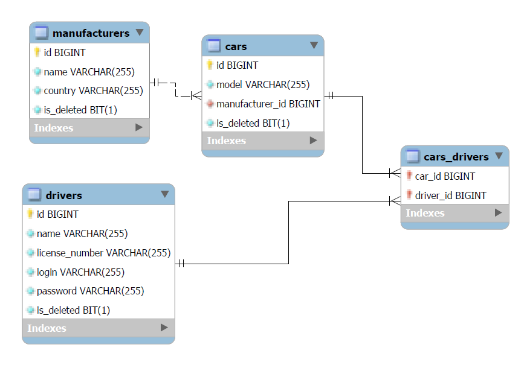

# :oncoming_taxi:Taxi Service:oncoming_taxi:
## Project description:

The goal of this project is to create a taxi service. The project implements driver authentification with different functionality. 
To use all features you need to create new driver and log in, after that you can:
* Create new car, manufacturer or driver
* Display all drivers/cars/cars by driver/manufacturers
* Add driver to car.

## Implementation details:
Project based on 3-layer architecture:

* Presentation layer (controllers)
* Application layer (services)
* Data access layer (DAO)

## Technologies:

* Java 11
* Apache Tomcat - version 9.0.64
* MySQL - version 8.0.22
* JDBC
* Servlet
* JSTL
* JSP
* HTML, CSS

## Database diagram:

## Setup

1. Fork this project.
2. Install and Configure Apache Tomcat 9.
    * Use taxi_service:war exploded.
    * Leave @Application contex@ : "/".
3. Install MySQL and MySQL Workbench(is not necessary, you can use another).
4. Initialize the MySQL database using the init.sql file.
    * In MySQL Workbench create and open new connection with your credentials or use the existing one, 
      open src/main/resources/init_db.sql, File->Open SQL script and execute this script Query->Execute.
5. In the /util/ConnectionUtil.java class change the USERNAME, PASSWORD, URL, and JDBC_DRIVER
    properties to the ones you specified when installing MySQL.
6. After starting the project, click on "Register" to add the first driver.
